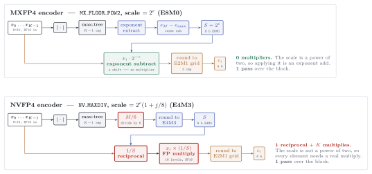
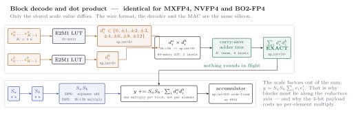

# Block-scaled formats

A ``12{:}1`` dynamic range covers nothing on its own, so deployed FP4 always travels
with a shared scale over a small block — floating point wrapped around fixed point's
oldest idea, the agreed scale factor.

```@docs
BlockFormat
ScaleRule
MXFP4
NVFP4
MXINT4
```

## The scale rule, and why it is what it is

```@docs
block_scale
elem_emax
```

``S = 2^{\lfloor\log_2 M\rfloor - e_{\max}}`` is the **unique** power of two landing the
block maximum in the element grid's top binade: ``M/S = 4f \in [4,8)``. One step larger
strands the maximum an octave low — wasting the codes 4 and 6, and doubling the
effective grid step for every element. One step smaller guarantees the block's most
energetic value saturates.

## Encoding

The two shipped schemes differ only in how the scale is chosen and, as a consequence, in
what applying it costs. MXFP4's scale is a power of two, so it is applied with an
**exponent subtract**; NVFP4's is not, so every element needs a real multiply and the
block needs a reciprocal.



Read the coloured boxes as the cost story: green is free (a shift), red is a multiplier.
MXFP4's encoder contains **no multiplier at all** — a fact easy to lose, because the
scheme is usually introduced as the *cheaper* format on quality grounds rather than
encoder grounds. See [`BO2_BRACKET`](@ref ScaleRule) in
[Improved FP4 schemes](@ref) for an encoder that keeps NVFP4's wire format and
quality while dropping the multiplier again.

```@docs
quantize_block
QuantizedBlock
quantize_blocked
reconstruct
dequantize
```

## The window theorem

```@docs
dead_zone_threshold
good_zone_threshold
zeroed_count
```

An MX block faithfully represents only what lives within about 21–30 dB of its own
absolute maximum. Everything below ``M/32`` comes back as **exact zero**.

!!! warning "The block ℓ₂ error is nearly useless as an acceptance metric"
    Three very different blocks — Gaussian, Gaussian with one ``64\times`` outlier,
    and a ``4096\times`` log-spread — all report a comfortable ``\sim10\%`` ℓ₂ error
    while silently zeroing 3, 31 and 21 of their 32 elements. Judge blocks by
    [`zeroed_count`](@ref) and the per-element profile.

## Arithmetic

Every block format in this package decodes and multiplies through **the same datapath**.
Only the stored scale value differs; the wire format, the element lookup, the exact
integer core and the accumulator are the same silicon.



Two properties are worth reading off the figure. The `ap_int<14>` core is **exact** —
`K` products of `ap_int<9>` bounded by `K·144 = 4608`, so nothing rounds in flight. And
the scale factors out of the sum entirely, `y = S_a S_b Σ_i e_i e'_i`, which is why one
multiply is needed **per block** rather than per element — and why blocks must lie along
the reduction axis.

```@docs
block_dot
BlockDotResult
block_gemm
core_sum_bound
```

The whole design rests on one factorisation:

```math
y = \sum_i (S_a e^a_i)(S_b e^b_i) = S_a S_b \sum_i e^a_i e^b_i
```

so the scales never enter the inner loop. The core sum is bounded by
``K \times 6 \times 6 = 1152``, which fits in a dozen integer bits plus two fraction
bits — so the adder tree is plain narrow fixed point with **no rounding anywhere**.

## Cost

```@docs
bits_per_element
bits_per_block
storage_bytes
compression_ratio
scale_fixup_overhead
```
