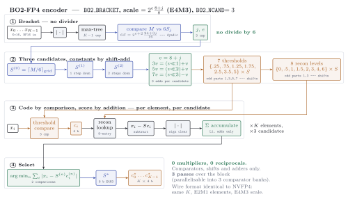

# Improved FP4 schemes

Can one do better than MXFP4 and NVFP4 while keeping what makes them cheap? Yes — and
the constraint is what must *not* change.

## What has to be preserved

MXFP4's computational structure rests on four facts. Every scheme here keeps all of them:

1. every ``E2M1 \times E2M1`` product is **exact** in the wide accumulator;
2. the per-block adder tree is **exact** (bounded by ``K\cdot6^2``), so nothing rounds in flight;
3. the scale factors out of the inner loop entirely, ``y = S_a S_b \sum_i e_i e'_i``;
4. the element grid stays E2M1, so FP4-native tensor cores multiply it natively.

What is left to improve is therefore only the **scale** — which value it takes and how it
is chosen. That is an encoder-side decision, and for the power-of-two rules it costs no
hardware at all.

## The optimized shift rule

Standard MXFP4 with **one added comparison** in the encoder and an unchanged decoder.
Compute ``E' = \lfloor\log_2 M\rfloor`` and the maximum's mantissa fraction
``\varphi = \log_2 M - E'``; then

```math
e_x = E' - 2 + \mathbb{1}[\varphi > \varphi^*],
\qquad \varphi^*_{K=32} = 0.86, \quad \varphi^*_{K=16} = 0.82
```

— use the ordinary floor scale unless the scaled maximum would land beyond
``u^* = 4\cdot2^{\varphi^*} \approx 7.26`` (resp. 7.06), the insurance zone where the
clamp toward code 6 is most severe, in which case shift one binade up.

```@docs
mx_scale_opt
PHISTAR
opt_shift_threshold
opt_shift_fires
opt_shift_rate
MXFP4_OPT32
MXFP4_OPT16
plot_opt_shift
```

```@example imp
using xpuFP, CairoMakie, Random # hide
plot_opt_shift(; K = 32, x = randn(MersenneTwister(1), 120_000))
```

Measured on 2×10⁵ Gaussian samples:

| K | φ* | u* | floor | opt-shift | class ceiling | fires on |
|--:|--:|--:|--:|--:|--:|--:|
| 32 | 0.86 | 7.26 | 18.800 | **19.058** | 19.063 | 13.3 % |
| 16 | 0.82 | 7.06 | 18.587 | **19.188** | 19.193 | 20.6 % |

It lands **within 0.005 dB** of what the entire power-of-two class can achieve, capturing
98–99 % of the available gain.

!!! tip "Why this beats `BEST_POW2` in hardware, for the same result"
    Best-of-two-powers must quantize the whole block *twice* and compare the two MSEs —
    64 roundings per 32-element block. The shift rule needs **one comparison** on the
    maximum's mantissa against a precomputed constant. Same accuracy, a fraction of the
    encoder work.

!!! note "The decoder cannot tell which encoder ran"
    `e_x` is still an ordinary E8M0 exponent, so the wire format is byte-identical and
    decoding is the same `x̂ᵢ = eᵢ·2^{X-127}`. Verified over 50 random blocks: same code
    count, same bits per block, same decode rule. An MXFP4 decoder reads this stream
    correctly with no changes at all.

## The bracket rule: a multiplier-free encoder

`OPT_SHIFT` above improves the *power-of-two* class. `BO2_BRACKET` does the same job one
class up — for the **E4M3-scaled** formats, where NVFP4 lives — and it does it with no
multiplier anywhere in the encoder.

NVFP4's encoder is `S = R_{E4M3}(M/6)`, then every element is multiplied by `1/S` before
rounding onto the E2M1 grid. That is a divide, a reciprocal, and a multiply per element.
`BO2_BRACKET` replaces all three:

1. **Bracket, don't divide.** The two grid scales surrounding `M/6` are found by
   comparing `M` against precomputed `6S`. Writing `S = 2^e(8+j)/8`, we have
   `6S = 2^{e+2}(24+3j)/16` — dyadic, so the comparison needs no divider.
2. **Quantize by threshold, don't multiply.** Instead of scaling each element and
   comparing against E2M1's cell boundaries, scale the **boundaries** once per block and
   compare each element directly. The boundaries are
   ``\{0.25, 0.75, 1.25, 1.75, 2.5, 3.5, 5\}`` — odd parts ``\{1,3,5,7\}`` only — and the
   E2M1 grid itself is ``\{0, 0.5, 1, 1.5, 2, 3, 4, 6\}`` — odd parts ``\{1,3\}`` only.
   So with `v = 8+j`, computing `{v, 3v, 5v, 7v}` costs **three adds**
   (`3v = (v≪1)+v`, `5v = (v≪2)+v`, `7v = (v≪3)−v`), and every threshold and every
   reconstruction level is then a pure **shift** of one of those four. Each element's
   code is three comparisons.
3. **Select on absolute error.** Score each candidate by ``\sum_i |x_i - S c_i|`` and keep
   the smallest. Errors are subtracts, the metric is adds. **No squaring, and no
   multiplier in the encoder at all.**



Every box in stages 2 and 3 is a comparator, a shift or an adder. Stage 1 avoids the
divide by comparing `M` against `6S` rather than forming `M/6`; stage 2 builds all 15
per-block constants from three adds; stage 3 codes each element by threshold comparison
and scores it by subtraction and addition. Compare the NVFP4 encoder in
[Block formats](@ref), where the same work needs a reciprocal and a full-width float
multiply per element.

### Why three candidates, and not more

The rule selects on *absolute* error, which tracks squared error closely over a short
bracket and drifts over a long one — L1 tolerates a few large residuals that L2 punishes,
so a long candidate list pulls the choice toward over-aggressive overloading. Measured at
`K = 16`, E4M3, Gaussian:

| candidates | L1 SNR | L2 SNR | cost of using L1 |
|---:|---:|---:|---:|
| 2 | 20.956 | 21.057 | 0.101 |
| **3** | **21.063** | 21.250 | 0.188 |
| 4 | 20.964 | 21.256 | 0.292 |
| 6+ | 20.945 | 21.256 | 0.311 |

L2 improves monotonically and saturates at four. **L1 peaks at three and then gets
absolutely worse.** The cheap metric is safe *because* the bracket is short, which is why
[`BO2_NCAND`](@ref) is part of the rule rather than a knob to raise.

### Measured

Same wire format as NVFP4 throughout — same `K`, same E2M1 elements, same E4M3 scale,
same decode path, same MAC:

| scheme | bits | gaussian | outlier | student-t₃ | lognormal | QSNR p10 |
|:---|---:|---:|---:|---:|---:|---:|
| MXFP4 | 4.250 | 18.80 | 14.92 | 16.87 | 16.64 | 17.31 |
| NVFP4 | 4.500 | 20.44 | 20.91 | 21.04 | 20.65 | 18.66 |
| **BO2-FP4 K=16** | 4.500 | **21.06** | **20.95** | **21.32** | **20.87** | **19.48** |
| BO2-FP4 K=32 | 4.250 | 20.39 | 18.10 | 19.65 | 19.09 | 19.27 |
| K16-E4M3-MSE_OPTIMAL | 4.500 | 21.59 | 21.02 | 21.63 | 21.16 | 20.29 |

**+0.62 dB pooled and +0.82 dB on the tenth-percentile block over NVFP4**, on every
distribution, for an encoder that is strictly cheaper than the one it replaces. The
`K = 32` row is the same rule at MXFP4's bit rate: **+1.59 dB over MXFP4 for the same
4.25 bits per value.**

The last row is the ceiling: an exhaustive search over the same grid reaches 21.59 dB.
The three-candidate bracket captures about two-thirds of that gain at a small fraction of
the cost, which is the right place on the curve for an encoder that has to be cheap —
compare [`MSE_OPTIMAL`](@ref ScaleRule), which evaluates roughly a dozen distinct scales
and needs a squared-error accumulator to do it.

!!! note "Regenerating the diagrams"
    The figures are TikZ, with sources in `docs/tikz/` and rendered SVGs committed to
    `docs/src/assets/`. Run `docs/tikz/build.sh` after editing a `.tex` — it needs
    `pdflatex` and `pdf2svg`. The SVGs are committed precisely so the documentation CI
    does **not** need a LaTeX toolchain. The sources are standalone, so they drop
    straight into a paper.

!!! note "Two separable ideas"
    The threshold-comparison element coding of step 2 is **independent of the rest**. It
    produces bit-identical output for *any* block format, including stock NVFP4, and
    removes the per-element multiply and the reciprocal with no change in quality. Step 3
    is what buys the decibels, at one comparison pass per candidate. Cost them separately.

## The schemes

```@docs
MXFP4_BEST32
MXFP4_BEST16
NVFP4_BEST16
XPFP4_32
XPFP4_16
IMPROVED_BLOCK_FORMATS
```

## Hadamard rotation

```@docs
hadamard
RotatedBlockFormat
rotated
```

An orthonormal rotation of each block before quantizing, costing **only additions and
subtractions**. It is orthogonal to the whole ladder: it composes with any scale rule and
is exactly invertible.

On i.i.d. Gaussian data it changes nothing — rotating an isotropic distribution gives the
same distribution. Its value is entirely on real tensors with outliers, where it smears a
lone large value across all ``K`` coordinates instead of letting it capture the shared
scale and wreck its neighbours.

## Measured

```@docs
compare_block_schemes
print_scheme_table
BlockSchemeReport
plot_block_schemes
```

```@example imp
using xpuFP, CairoMakie, Random, Statistics # hide
studentt(rng, n, nu) = [randn(rng) / sqrt(sum(abs2, randn(rng, nu)) / nu) for _ in 1:n] # hide
rng = MersenneTwister(7); N = 30_000 # hide
g = randn(rng, N); o = copy(g); for i in 1:40:N; o[i] *= 20; end # hide
ds = ["gaussian" => g, "t3" => studentt(rng, N, 3), "outlier" => o] # hide
plot_block_schemes(ds; rotate = true)
```

Without rotation, on Gaussian / Student-t₃ / outlier data:

| scheme | K | scale | b/val | applied by | gauss | t₃ | outlier | zeroed (outlier) |
|:---|--:|:--|--:|:--|--:|--:|--:|--:|
| `NVFP4_BEST16` | 16 | E4M3 | 4.50 | multiply | 21.59 | 21.42 | 21.06 | 21.2 % |
| `XPFP4_32` | 32 | E4M3 | **4.25** | multiply | 20.75 | 19.84 | 18.27 | 36.4 % |
| `NVFP4` | 16 | E4M3 | 4.50 | multiply | 20.43 | 20.83 | 20.95 | 21.0 % |
| `MXFP4_BEST16` | 16 | E8M0 | 4.50 | **exp add** | 19.15 | 17.94 | 16.96 | 24.0 % |
| `MXFP4_BEST32` | 32 | E8M0 | **4.25** | **exp add** | 19.02 | 17.14 | 15.31 | 40.7 % |
| `MXFP4` | 32 | E8M0 | 4.25 | exp add | 18.78 | 16.92 | 14.88 | 38.5 % |

With Hadamard rotation, the annihilation rates collapse:

| scheme | gauss | t₃ | outlier | zeroed (outlier) |
|:---|--:|--:|--:|--:|
| `H·NVFP4_BEST16` | 21.61 | 21.59 | 22.18 | 5.0 % |
| **`H·XPFP4_32`** | **20.76** | **20.83** | **21.47** | **1.2 %** |
| `H·NVFP4` | 20.44 | 20.13 | 18.80 | 3.9 % |
| `H·MXFP4_BEST32` | 19.05 | 19.23 | 19.80 | 1.9 % |
| `H·MXFP4` | 18.80 | 18.94 | 19.47 | 2.2 % |

## What to take from it

**If the scale must stay an exponent add** (MXFP4's real hardware advantage), use
`MXFP4_BEST32`: +0.24 dB for one comparison at encode time, zero change to wire format,
decoder or MAC. Add rotation and it reaches 19.05 / 19.23 / 19.80 dB with under 2 % of
coordinates annihilated — against plain MXFP4's 38.5 %.

**If a small scale multiply is acceptable**, `H·XPFP4_32` beats shipped NVFP4 on every
dataset *and* uses fewer bits (4.25 vs 4.5), with a 17× lower annihilation rate. It gets
there by spending the finer E4M3 scale over 32 elements instead of 16, which also halves
the scale-application rate.

!!! warning "SNR alone would have chosen differently"
    On outlier data, plain `NVFP4` posts a *higher* SNR (20.95) than `XPFP4_32` (18.27) —
    while zeroing 21 % of coordinates against 36 %. Both numbers are flattered by energy
    weighting: the well-represented outliers carry most of the energy, so SNR rewards
    getting them right and is blind to the annihilated neighbours. This is the report's
    own warning, reproduced. Read [`zeroed_count`](@ref) alongside.

!!! note "The best-of-two-powers rule trades annihilation for SNR"
    `MXFP4_BEST32` has *higher* SNR than `MXFP4` (19.02 vs 18.78) but zeroes **more**
    coordinates on outlier data (40.7 % vs 38.5 %), because choosing the larger scale
    accepts clipping at the top in exchange for resolution in the middle, pushing more
    small values under the dead-zone threshold. It is not a free win on every axis.
